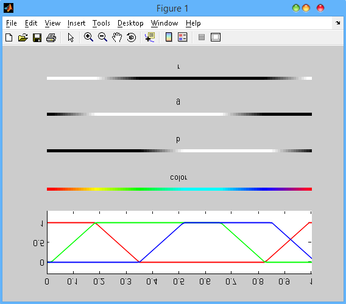

Colormap 
========

This repository is a collection of colormap.

Thanks for [kbinani](https://github.com/kbinani/glsl-colormap) providing the algorithm.

## Matlab 
eg. The hsv colormap:
``` matlab
[r g b x] = hsv(100);
run show
```

